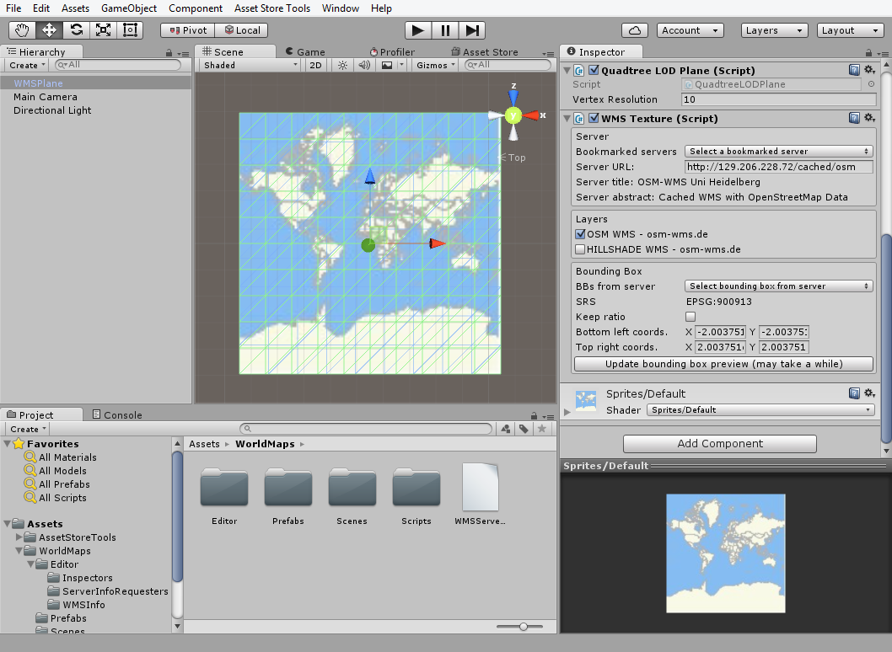
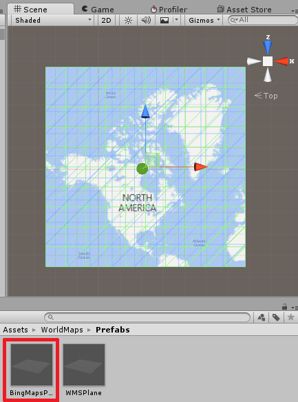
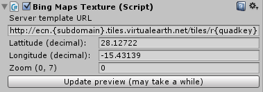

# World maps

**World Maps** is a Unity package which allows users to add real world LOD maps to their scenes. Just drop the right plane prefab into the scene and configure it so its textures are retrieved from a [WMS](https://en.wikipedia.org/wiki/Web_Map_Service) or a [BingMaps](https://en.wikipedia.org/wiki/Bing_Maps) server.

## Sample scene

To take a look at the possibilities of this package. Just open the scene WorldMaps/Scenes/SampleScene.unity

## Adding world maps to the sceen

### Adding a WMS map to the scene

#### Important notes

- Only WMS 1.1.0 has been tested.
- Some WMS servers include restrictions about its use. Check them before using such servers in your projects.

#### Procedure

1. Drag the prefab WorldMaps/Prefabs/WCSTerrain.prefab and drop it into the scene.

  

2. With the plane selected, a WMSTexture inspector should appear on the right. 

  

4. Edit the inspector fields to meet your requirements:
  1. Select a server(\*) from the bookmarks list or by writting a custom URL and wait a moment for the inspector to load the data from server. If any errors arises, it will be output to both the inspector and the console.
  2. Under the "Layers" panel, mark the layer(s) you want to display. Every time a layer is marked / unmarked, the plane texture is updated from server.
  3. Under the "Bounding box" panel, select a bounding box from the list provided by the server or insert a custom one. Changes in bounding box doesn't update the plane texture automatically. Instead, the button "Update bounding box preview" must be pressed.

5. Enjoy the new scene with your map!

(\*) **Important:** Remember that some WMS servers include restrictions about its use. Check them before using such servers in your projects.

### Adding a BingMaps map to the scene

#### Requirements - Getting a BingMaps key

In order to use BingMaps you need one or two things:

- According to your user case, **you may need to get permission from Microsoft** to use its API (See [Microsoft® Bing™ Maps Platform APIs’ Terms Of Use](https://www.microsoft.com/maps/product/terms.html)).
- **Generating and using a BingMaps key**.

1. Get a BingMaps key by following the steps listed in ["Creating a Bing Maps Key"](https://msdn.microsoft.com/es-es/library/ff428642.aspx)
2. Visit <http://dev.virtualearth.net/REST/V1/Imagery/Metadata/Road?mapVersion=v1&output=xml&key=BingMapsKey>, **replacing BingMapsKey with your Bing Maps key**.
3. Visiting previous URL should return an XML file. Copy the image url returned in \<ImageUrl\>.

#### Adding a BingMaps map to the scene

1. Drag the prefab WorldMaps/Prefabs/BingMapsTerrain.prefab and drop it into the scene.

  
  
2. With the plane selected, a BingMapsComponent inspector should appear on the right. 

  
  
  1. Paste the URL retrieved in previous section "Requirements - Getting a BingMaps key" into the "Server template URL" text field.
  2. Set both the latitude and the longitude of the point for wich you want to get a map, as well as a zoom level.
  3. Press "Update preview" to update the scene view with the BingMaps texture and check that everything is OK.
